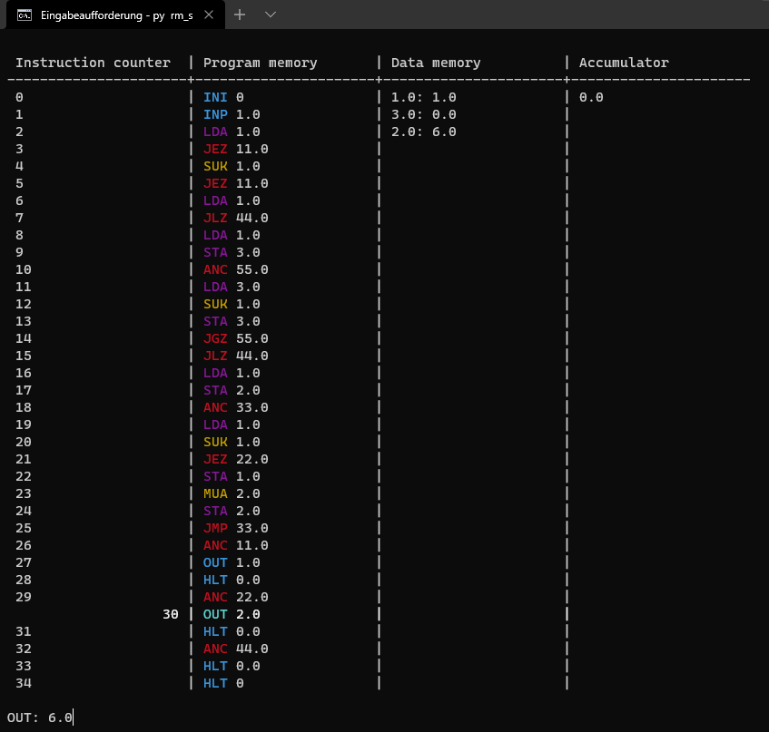
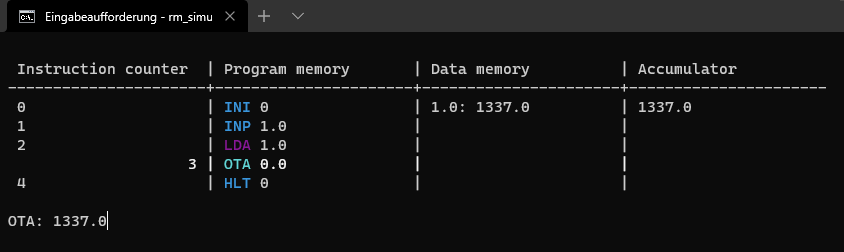

# Register Machine Simulator

[](LICENSE.txt)&nbsp;
[](https://www.python.org/downloads/)&nbsp;
[](https://github.com/InformaticFreak/register-machine-simulator/releases/tag/2021.6)&nbsp;
[](https://www.codefactor.io/repository/github/informaticfreak/register-machine-simulator/overview/main)&nbsp;
&nbsp;

A simulator for a simple register machine as an code interpreter written in Python. The register machine language defines 30 different commands for basic input, output and arithmetic operations. See [here](README.md#required-packages) for the required packages.

See the change log [here](CHANGELOG.md) and [send Feedback](https://forms.office.com/r/AcCacrp6j8).

Developed by InformaticFreak (c) 2021

## How to use

Execute the Python file `rm_simulator.py` via the console/terminal and as a first command line parameter pass the path to the `.rm` code file. Optionally add a `p` as second command line parameter to get the status of the complete register machine before each instruction or `w` for the status and an additional wait for pressing the <kbd>ENTER</kbd> key to continue after each instruction. Also optionally add a wait time in milliseconds between each instruction as the last command line parameter, ten milliseconds is default.

```
py rm_simulator.py [path] [optional p or w] [optional time]
```

### Language markdown for Notepad++

Copy the markdown files [rm_markdown.xml](rm_markdown.xml) and [rm_markdown_DM.xml](rm_markdown_DM.xml) for the register machine language in the directory `C:\Users\%USERNAME%\AppData\Roaming\Notepad++\userDefineLangs\`. Now select `register machine` or `register machine (dark mode)` in Notepad++ in the `Languages` menu item below.

### An example: calculation of the faculty of an integer

The file `examples/faculty.rm` contains the code for the calculation, click [here](examples/faculty.rm) to open it. Because the source file `rm_simulator.py` is located in the directory `src` the relative path to the example file is `../examples/faculty.rm`. To see the status of the register machine while the program is running, the last parameter is `p`. After each instruction the program waits 500 milliseconds (0.5 seconds).

```
py rm_simulator.py ../examples/faculty.rm p 500
```

So after the start of the program, the program waits with printing `INP: `&nbsp;for the input of a number to calculate its faculty. You can also enter a decimal number or a negative number, but an integer is required. This wrong inputs are intercepted by the register machine program code in [line 13](examples/faculty.rm#L13) and [line 17](examples/faculty.rm#L17). In this case the input number is `3`.

While the program is running, the status of the complete register machine is updated after each instruction. The commands are highlighted in the console, the current line is brighter and the instruction counter is right-aligned at the current position.

There is the current status of the complete register machine after the full calculation:



After a while, the program returns the result as `OUT: 6`; then the program is terminated. If a wrong number is entered, no output will be printed.

## Documentation

### Required packages

- [colorama](https://pypi.org/project/colorama/)

### The syntax

- A command is composed of a three character long keyword and a number as parameter separated by a space character&nbsp;` `
- A comment starts with an hashtag character&nbsp;`#`&nbsp;at the beginning of a line or behind a command, separated by a space character&nbsp;` `
- Only one command per line and any number of blank lines are allowed
- The keywords are not case sensitve
- A Parameter is always a number, it can contain underscores&nbsp;`_`&nbsp;*(but not more than one in a sequence)* and any number of zeros&nbsp;`0`, a dot&nbsp;`.`&nbsp;as decimal point also works
- A program is terminated with the command&nbsp;`HLT 0`, if this command is not in the last line of the program at the latest, it terminates anyway

### All 30 commands

#### Start and terminate the program

| Command | Parameter | Description |
|---|---|---|
| `INI` | 0 | No functionality (internal use only) |
| `HTL` | 0 | Terminate the program |
| `BRK` | 0 | Breakpoint for debugging |

#### Load and store values

| Command | Parameter | Description |
|---|---|---|
| `LDK` | *number* | Load value *number* in accumulator |
| `LDA` | *addresse* | Load value from *addresse* in accumulator |
| `LDP` | *addresse* | Load value from address to which *address* points into accumulator |
| `STA` | *addresse* | Store value from accumulator in *addresse* |
| `STP` | *addresse* | Store value from accumulator in addresse, where *address* points to |

#### Anchor points and jumps to them

| Command | Parameter | Description |
|---|---|---|
| `ANC` | *anchor* | Anchor point with *anchor* as id |
| `JMP` | *anchor* | Unconditional jump to *anchor* |
| `JEZ` | *anchor* | Conditional jump to *anchor*, if value from accumulator is equal to zero |
| `JLZ` | *anchor* | Conditional jump to *anchor*, if value from accumulator is less than zero |
| `JGZ` | *anchor* | Conditional jump to *anchor*, if value from accumulator is greater than zero |
| `JNE` | *anchor* | Conditional jump to *anchor*, if value from accumulator is not equal to zero |
| `JLE` | *anchor* | Conditional jump to *anchor*, if value from accumulator is less than or equal to zero |
| `JGE` | *anchor* | Conditional jump to *anchor*, if value from accumulator is greater than or equal to zero |

#### Read input and print output

| Command | Parameter | Description |
|---|---|---|
| `INP` | *addresse* | Wait for user input with `INP: `&nbsp;and store the entered number in *addresse* |
| `OUT` | *addresse* | Print value from *addresse* |

#### Arithmetic operations

| Command | Parameter | Description |
|---|---|---|
| `ADK` | *number* | Add value *number* to value from accumulator |
| `ADA` | *addresse* | Add value from *addresse* to value from accumulator |
| `ADP` | *addresse* | Add value from addresse to which *addresse* points to value from accumulator |
| `SUK` | *number* | Subtract value *number* from value from accumulator |
| `SUA` | *addresse* | Subtract value from *addresse* from value from accumulator |
| `SUP` | *addresse* | Subtract value from addresse to which *addresse* points from value from accumulator |
| `MUK` | *number* | Multiply value *number* by value from accumulator |
| `MUA` | *addresse* | Multiply value from *addresse* by value from accumulator |
| `MUP` | *addresse* | Multiply value from addresse to which *addresse* points by value from accumulator |
| `DIK` | *number* | Divide value from accumulator by value *number* |
| `DIA` | *addresse* | Divide value from accumulator by value from *addresse* |
| `DIP` | *addresse* | Divide value from accumulator by value from addresse to which *addresse* points to |

## Modify the command names and the functionality

### Structure

All command names and references to the associated functions are stored in the private RM object attribute `__creg` in [line 57](src/rm_simulator.py#L57). Each associated function is defined as a private RM object method starting at [line 130](src/rm_simulator.py#L130). This function can manipulate the accumulator stored in the private RM object attribute `__accu`, the data memory stored in the private RM object attribute `__dmem` and the instruction counter stored in the private RM object attribute `__pind`. The associated function does not have to process the command parameter, but it must always be specified (!), like for example the command `HLT` do not need a parameter, so it can be anything, here in the examples it is always zero. The current parameter is stored in the private RM object attribute `__cpar`.

### The Syntax highlighting

The syntax highlighting for Notepad++ was created with a tool of the software, but still colors and keywords can be changed afterwards. The keywords are grouped by functionality as is the case here in the readme.

For the colored commands in the console the package *colorama* is used. The colors for the commands are stored in the private RM object attribute `__cmdr` in [line 90](src/rm_simulator.py#L90). In this dictionary, all keywords, each separated by a space, are combined into a single string, separated as the key and the colorama color as the associated value.

### Hints

- The command names in the command register must be in upper case
- Because the keywords are not case-sensitive, the syntax highlighting must consider both cases in a simplified way, all letters lowercase or all letters uppercase
- The command and associated function *may* have different names, but it is impractical
- **Do not forget to increment the instruction counter (at the end of the function, but before the optional return)**

### An example: add a new command, that print the value from the accumulator

The existing command `OUT` print the value from the given *addresse*, so we will add a new command `OTA` that print the value from the accumulator. `OTA` is inspired by "**O**u**T**put the **A**ccumulator".

#### Add the new command and a reference to the associated function to the command register

```python
self.__creg = {
	...
	"OTA": self.__OTA
}
```

- Do not forget to put the comma `,` after the last entry, here after the `"DIP": self.__DIP,` in [line 87](src/rm_simulator.py#L87)

#### Add the associated function to the RM object

```python
def __OTA(self):
	self.__pind += 1
	input(f"OTA: {self.__accu}\n")
```

- Increment the instruction counter at the end of the function, but before an optional return of an error code
- Print the value from the accumulator, but use the `input()` function so that the programm waits until the user hits the `ENTER` key

#### Error Codes

Each function returns `None`, if nothing more specific is defined and nothing special happens. If the `errorCode` is 0 the program terminates, if the `errorCode` is 1 the program waits if it should; otherwise an unexpected error code occurs.

To add custom error codes, you must add a new `elif` condition with your custom code after [line 314](src/rm_simulator.py#L314).

#### Update the syntax highlighting

Add the new output command in upper and lower case to the suitable group within the *markdown file* in [line 33](rm_markdown.xml#L33) ...

```xml
...
<Keywords name="Keywords7">INP OUT HLT INI BRK OTA inp out hlt ini brk ota</Keywords>
...
```

... and within the *command markdown register* stored in the private RM object attribute `__cmdr` in [line 77](src/rm_simulator.py#L77).

```python
self.__cmdr = {
	...
	"INP OUT HLT INI BRK OTA inp out hlt ini brk ota": Fore.CYAN
}
```

#### Try out your new command!

```
# Read user input and load it into the accumulator
INP 01
LDA 01

# Print the value from the accumulator
OTA 0
```

There is the current status of the complete register machine after the user has entered the real number `1337`:


